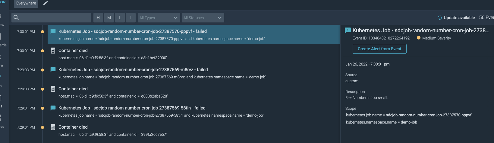

## Use Case ##

"I have a job inside Kubernetes that I want to monitor and send an event to Sysdig Monitor in the event of a failure." - _A Developer Using Kubernetes_


## Whats all this Voodoo that You do ##


Using our [SDC Python Client](https://docs.sysdig.com/en/docs/developer-tools/sysdig-python-client/) or through raw [Python Requests](https://docs.python-requests.org/en/latest/) or a simple CURL request if you are using a Script you can post a [Custom Event](https://docs.sysdig.com/en/docs/sysdig-monitor/events/custom-events/) to the Sysdig Backend with context from your job in the event of a failure.


In this example we have a job called `sdcjob-random-number-cron-job` that generates a random number between the values of 0 and 10 and determines if the number is less than or equal to 5. If the number meets the criteria for failure, it then triggers a custom Exception called `ValueTooSmallError`. While triggering this Exception it then takes information from the exception and job through the usage of Environment Variables passed to the container through [Kubernetes Data Injection](https://kubernetes.io/docs/tasks/inject-data-application/environment-variable-expose-pod-information/) and posts a Custom Event to the Sysdig Backend.


## Implementation ##


Retrieve your SYSDIG_MONITOR_API_TOKEN from the platform under Settings > User Profile and your SYSDIG_MONITOR_API_URL. Documentation on how to retrieve these can be found here:


[Backend URL](https://docs.sysdig.com/en/docs/administration/saas-regions-and-ip-ranges/#saas-regions-and-ip-ranges)


[API Token](https://docs.sysdig.com/en/docs/administration/administration-settings/user-profile-and-password/retrieve-the-sysdig-api-token/)

**Note: It is highly recommended that you setup a System Account to avoid inadvertant token rotation / expirations. Example coming soon.**

In this example we create a generic secret called `sysdig-api-token` in our namespace for our CronJob to reference and authenticate to our Sysdig Backend.

Please replace the following in the `secret.yml` with your appropriate values...and don't forget to [Base64 Encode](https://linux.die.net/man/1/base64) your Secret values!

```
  SYSDIG_MONITOR_API_TOKEN: <YOUR_SYSDIG_TOKEN_BASE_64>
  SYSDIG_MONITOR_API_URL: <YOUR_SYSDIG_URL_BASE_64>
```

Next create the generic secret with the following:

```
kubectl apply -n <YOUR_NAMESPACE> -f ./secret.yml
```

Once the secret is created you can create your Kubernetes CronJob by running the following:

```
kubectl apply -n <YOUR_NAMESPACE> -f ./job.yml
```

You now have a CronJob running inside your Kubernetes Cluster and namespace posting a Custom Event to the backend.

## Results ## 

Lets take a look at what we can now see in Sysdig Monitor via a screenshot:



Here you can see we're now getting custom events with the Scope of our Job Name and our Namespace that are passed into the event through the SDC Client.